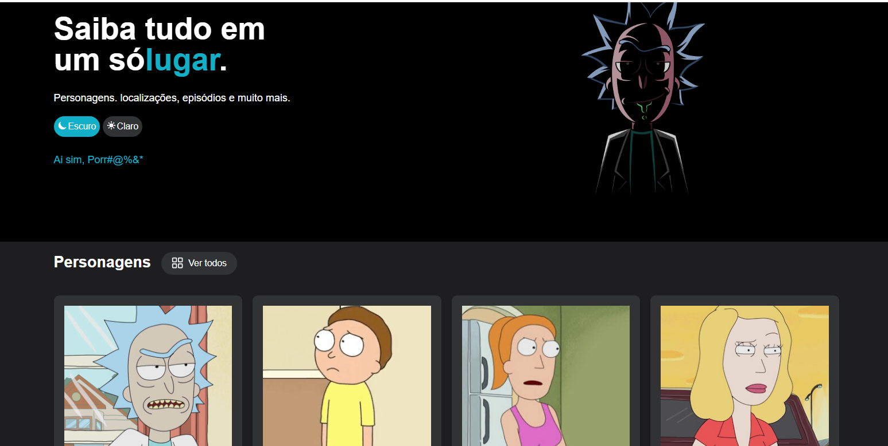
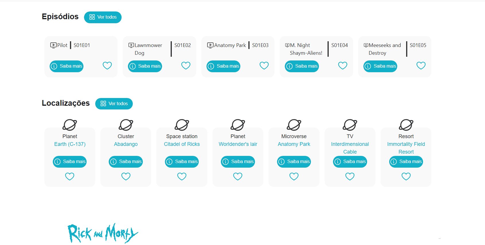
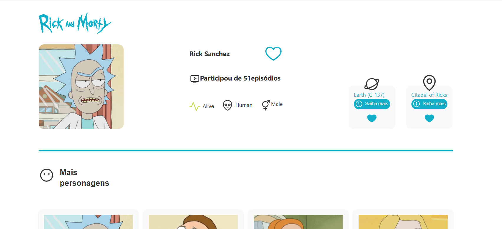
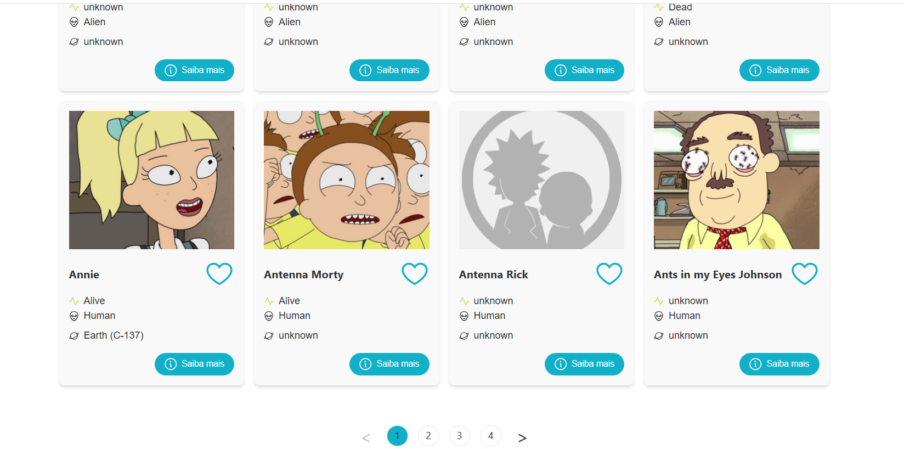
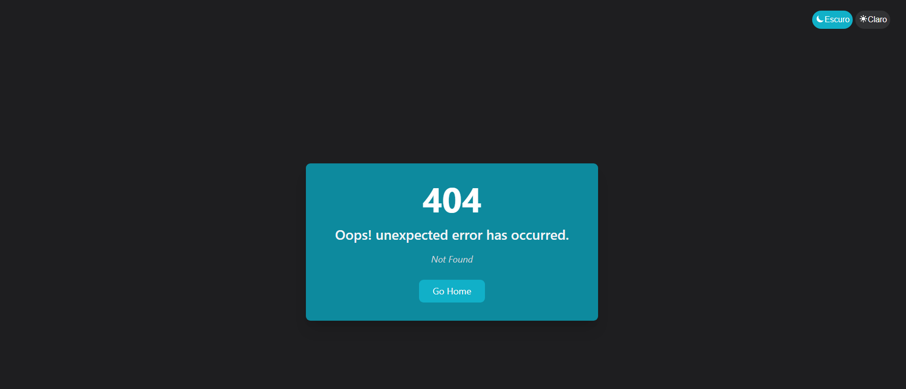

# Rick and Morty Web App

Eine interaktive Webanwendung mit React, die über die offizielle API Informationen zu den Charakteren, Episoden und Orten von Rick and Morty anzeigt

`Main Page Image `

## API Quellen

> `https://rickandmortyapi.com/api/character`

> `https://rickandmortyapi.com/api/location`

> `https://rickandmortyapi.com/api/episode`

---

## Features

- Display of character, episode, and location previews on the Home page

- Dynamic routing using React Router DOM v6+ with loader support

- Full pagination implemented on list pages

- Detailed view of each item accessible via the "Saiba Mais" button

- Support for Dark Mode

- Custom 404 error page for invalid or unknown routes

`Details Page`

`Pagination Page`

`404 Page`

### Technologies Used

- React
- Vite
- Axios
- Tailwind CSS
- React Router DOM

### Project Setup

1. Clone the repository
2. Run `npm install`
3. Rename `.env.example` to `.env` and add environment values
4. Run `npm run dev`
